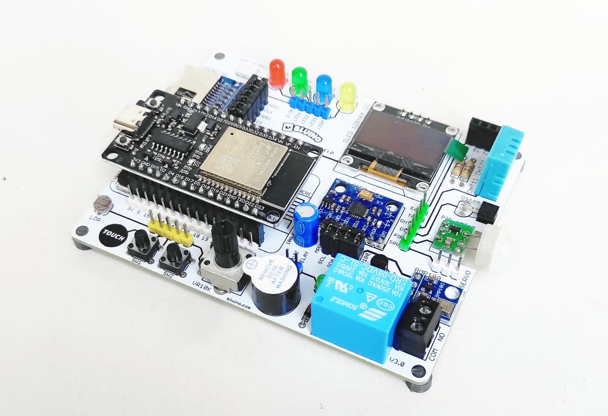
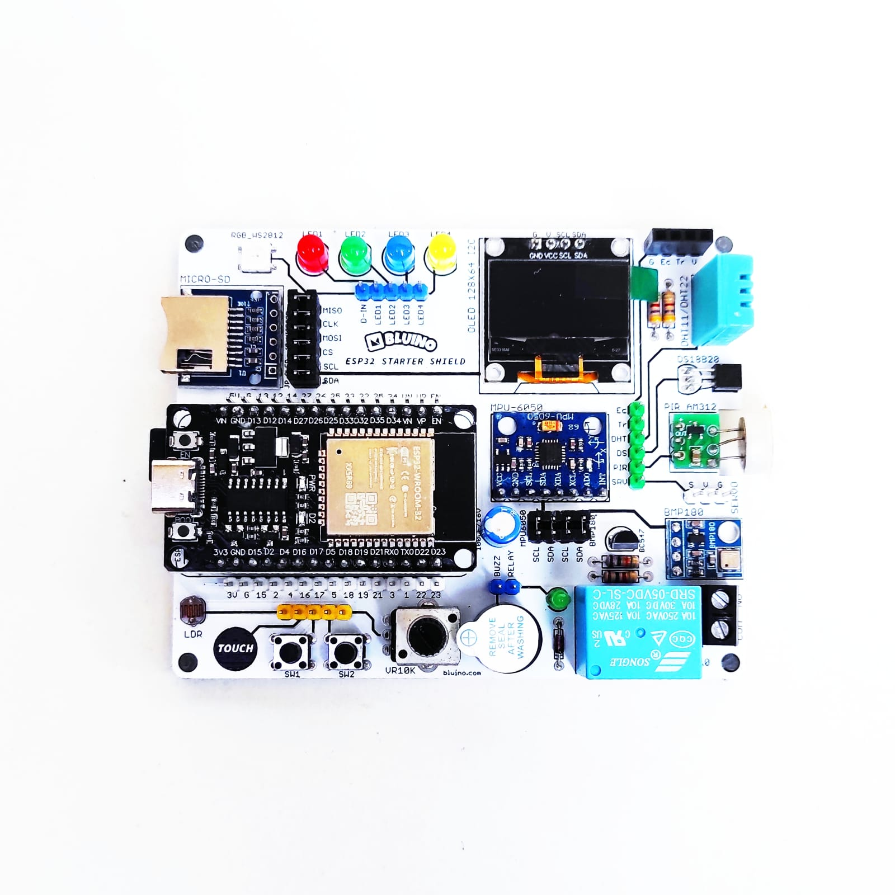
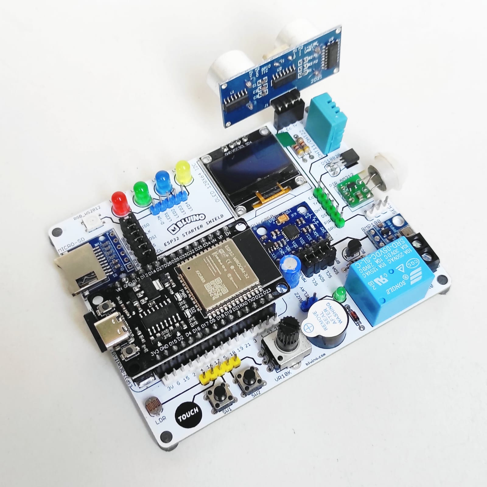

# 📘 ESP32 IoT Mastery — Kit Bluino

<p align="center">
  <br>
  
  
</p>

## 📋 Tentang Repository Ini

Repository ini berisi **materi pembelajaran ESP32 IoT lengkap** berbasis **Bluino ESP32 IoT Starter Shield v3.2**. Materi disusun dalam format BAB (chapter) sehingga bisa digunakan secara fleksibel — baik untuk kursus terstruktur maupun belajar mandiri.

> ⏳ **Status Pengembangan:** Saat ini materi kurikulum telah lulus **audit teknis tingkat rekayasa industri (Gold Standard)** dan rampung 100% hingga **BAB 35: OLED Display 128×64**. Sisa materi (BAB 36 dan seterusnya) sedang dalam tahap pengembangan dan antrean audit mendalam.

## ☕ Dukung Proyek Ini

Kurikulum *engineering-grade* ini dikembangkan dengan dedikasi penuh untuk mendukung kemajuan talenta IoT di Indonesia. Jika repositori ini memberikan manfaat bagi proses belajar, menjadi referensi riset, atau sekadar membantu kelancaran proyek Anda, dukungan Anda akan sangat berarti untuk keberlanjutan pengembangan bab-bab selanjutnya. 

Anda dapat memberikan apresiasi dan semangat dengan mentraktir penulis secangkir kopi melalui tautan berikut:

[](https://trakteer.id/limitless7/tip)

**💬 Kontak Penulis (Kritik & Saran):**
Bagi instansi atau individu yang membutuhkan pendampingan teknis, kerja sama riset, pelatihan khusus seputar IoT & ESP32, maupun ingin memberikan **kritik, saran, dan masukan** untuk perbaikan kurikulum ini, silakan hubungi:
- ✉️ **Email:** [antonprafanto@unmul.ac.id](mailto:antonprafanto@unmul.ac.id)
- 📞 **WhatsApp:** [0811-553-393](https://wa.me/62811553393) / [0852-5069-0673](https://wa.me/6285250690673)

Anda juga dapat berkontribusi secara langsung dengan membuka **Issue** atau **Pull Request** di repository ini jika menemukan *bug* pada kode atau kesalahan penulisan (*typo*).

## 🔧 Komponen Kit

| # | Komponen | Koneksi | Protokol |
|---|----------|---------|----------|
| 1 | ESP32 DEVKIT V1 | — | — |
| 2 | OLED 0.96" 128×64 | SDA=IO21, SCL=IO22 | I2C |
| 3 | DHT11 (Suhu & Kelembaban) | IO27 + pull-up 4K7Ω | Digital |
| 4 | DS18B20 (Suhu Presisi) | IO14 + pull-up 4K7Ω | OneWire |
| 5 | BMP180/BME280 (Barometrik) | SDA=IO21, SCL=IO22 | I2C |
| 6 | MPU-6050 (Akselerometer/Giroskop) | SDA=IO21, SCL=IO22 | I2C |
| 7 | RGB LED WS2812 (NeoPixel) | IO12 | Data (RMT) |
| 8 | Micro SD Adapter | CS=IO5, MOSI=IO23, CLK=IO18, MISO=IO19 | SPI |
| 9 | Touch Pad | Custom (rek: IO33) | Capacitive |
| 10 | 4× LED (Merah, Kuning, Hijau, Biru) | Custom + resistor 330Ω | Digital |
| 11 | 2× Push Button | Custom + pull-down 10KΩ | Digital |
| 12 | Active Buzzer | Custom | Digital |
| 13 | Potensiometer 10K | Custom | Analog (ADC) |
| 14 | LDR (Sensor Cahaya) | Custom + resistor 10KΩ | Analog (ADC) |
| 15 | PIR AM312 (Sensor Gerak) | Custom | Digital |
| 16 | Relay 5V + driver BC547 | Custom | Digital |
| 17 | HC-SR04 Connector (Ultrasonik) | Custom (Trig + Echo) | Digital |
| 18 | Servo Connector | Custom | PWM |

> **"Custom"** berarti komponen terhubung ke pin header — pengguna menghubungkan ke GPIO ESP32 yang sesuai menggunakan kabel jumper Dupont.

## 📌 Pin Mapping — Koneksi Tetap (Hardwired)

```
┌─────────────────────────────────────────────────────────┐
│                    I2C Bus (Shared)                      │
│  IO21 (SDA) ──── OLED + BMP180 + MPU-6050               │
│  IO22 (SCL) ──── OLED + BMP180 + MPU-6050               │
├─────────────────────────────────────────────────────────┤
│                    SPI Bus                               │
│  IO5  (CS)   ──── MicroSD                                │
│  IO23 (MOSI) ──── MicroSD                                │
│  IO18 (CLK)  ──── MicroSD                                │
│  IO19 (MISO) ──── MicroSD                                │
├─────────────────────────────────────────────────────────┤
│                   Sensor Digital                         │
│  IO27 ──── DHT11 (+ pull-up 4K7Ω)                       │
│  Custom ── Touch Pad (Pilih pin T4-T9 yang tersedia)    │
│            digunakan bersamaan dalam satu program         │
│  IO14 ──── DS18B20 (+ pull-up 4K7Ω)                     │
│  IO12 ──── RGB LED WS2812                                │
└─────────────────────────────────────────────────────────┘
```

## ⚠️ Restricsi GPIO ESP32

| GPIO | Status | Keterangan |
|------|--------|------------|
| IO0 | ⚠️ Strapping | Boot mode — hindari untuk I/O umum |
| IO1 | ❌ TX0 | Serial Monitor output — jangan dipakai |
| IO2 | ⚠️ Strapping | Harus LOW saat boot — bisa dipakai dengan hati-hati |
| IO3 | ❌ RX0 | Serial Monitor input — jangan dipakai |
| IO6–IO11 | 🚫 Dilarang | Terhubung ke flash SPI internal |
| IO12 | ⚠️ Strapping | MTDI pin — harus LOW saat boot. Sudah dipakai WS2812 pada kit ini |
| IO15 | ⚠️ Strapping | Boot log — bisa dipakai dengan hati-hati |
| IO34–IO39 | ℹ️ Input Only | Tidak ada internal pull-up, hanya bisa input |

## 📚 Daftar BAB

### Bagian I — Fondasi & Persiapan
| BAB | Topik |
|-----|-------|
| [BAB 01](BAB-01/) | Apa itu IoT & Embedded Systems |
| [BAB 02](BAB-02/) | Pengenalan ESP32 |
| [BAB 03](BAB-03/) | Dasar Elektronika untuk Mikrokontroler |
| [BAB 04](BAB-04/) | Membaca Schematic & Datasheet |
| [BAB 05](BAB-05/) | Setup Lingkungan Pengembangan |
| [BAB 06](BAB-06/) | Pin Mapping Kit Bluino & Restricsi GPIO |
| [BAB 07](BAB-07/) | Program Pertama — Hello World |

### Bagian II — GPIO & Sinyal
| BAB | Topik |
|-----|-------|
| [BAB 08](BAB-08/) | Digital Output — LED & Buzzer |
| [BAB 09](BAB-09/) | Digital Input — Push Button |
| [BAB 10](BAB-10/) | Interrupt & ISR |
| [BAB 11](BAB-11/) | Analog Input & ADC |
| [BAB 12](BAB-12/) | PWM dengan LEDC |
| [BAB 13](BAB-13/) | DAC — Output Analog Asli |
| [BAB 14](BAB-14/) | Capacitive Touch |
| [BAB 15](BAB-15/) | Timer Hardware |

### Bagian III — Pemrograman Embedded Profesional
| BAB | Topik |
|-----|-------|
| [BAB 16](BAB-16/) | Non-Blocking Programming |
| [BAB 17](BAB-17/) | State Machine |
| [BAB 18](BAB-18/) | Callback & Event-Driven Programming |
| [BAB 19](BAB-19/) | Kode Terstruktur — Multi-File |
| [BAB 20](BAB-20/) | Memory Management |
| [BAB 21](BAB-21/) | Debugging & Troubleshooting |

### Bagian IV — Protokol Komunikasi
| BAB | Topik |
|-----|-------|
| [BAB 22](BAB-22/) | UART / Serial Communication |
| [BAB 23](BAB-23/) | I2C — Inter-Integrated Circuit |
| [BAB 24](BAB-24/) | SPI — Serial Peripheral Interface |
| [BAB 25](BAB-25/) | OneWire Protocol |

### Bagian V — Sensor
| BAB | Topik |
|-----|-------|
| [BAB 26](BAB-26/) | DHT11 — Suhu & Kelembaban |
| [BAB 27](BAB-27/) | DS18B20 Lanjutan — Deep Sleep, Parasitic Power & Data Filter |
| [BAB 28](BAB-28/) | BMP180 — Tekanan Udara & Altitude |
| [BAB 29](BAB-29/) | MPU-6050 — Akselerometer, Giroskop & Filter Orientasi |
| [BAB 30](BAB-30/) | HC-SR04 — Sensor Jarak Ultrasonik & Deteksi Objek |
| [BAB 31](BAB-31/) | PIR AM312 — Deteksi Gerakan |
| [BAB 32](BAB-32/) | LDR — Sensor Cahaya |
| [BAB 33](BAB-33/) | Sensor Internal ESP32 |
| [BAB 34](BAB-34/) | Pemrosesan Data Sensor |

### Bagian VI — Aktuator & Tampilan
| BAB | Topik |
|-----|-------|
| [BAB 35](BAB-35/) | OLED Display 128×64 |
| [BAB 36](BAB-36/) | RGB LED WS2812 (NeoPixel) |
| [BAB 37](BAB-37/) | Relay — Kontrol AC/DC |
| [BAB 38](BAB-38/) | Servo Motor |

### Bagian VII — Penyimpanan Data
| BAB | Topik |
|-----|-------|
| [BAB 39](BAB-39/) | NVS — Non-Volatile Storage |
| [BAB 40](BAB-40/) | SPIFFS / LittleFS |
| [BAB 41](BAB-41/) | MicroSD Card — Data Logging |

### Bagian VIII — WiFi & Web
| BAB | Topik |
|-----|-------|
| [BAB 42](BAB-42/) | WiFi Station Mode |
| [BAB 43](BAB-43/) | WiFi Access Point |
| [BAB 44](BAB-44/) | WiFiManager & Captive Portal |
| [BAB 45](BAB-45/) | mDNS |
| [BAB 46](BAB-46/) | Web Server |
| [BAB 47](BAB-47/) | WebSocket — Real-time |
| [BAB 48](BAB-48/) | HTTP Client & REST API |
| [BAB 49](BAB-49/) | HTTPS & Keamanan |

### Bagian IX — Protokol IoT
| BAB | Topik |
|-----|-------|
| [BAB 50](BAB-50/) | MQTT |
| [BAB 51](BAB-51/) | CoAP |
| [BAB 52](BAB-52/) | Bluetooth Classic |
| [BAB 53](BAB-53/) | BLE — Bluetooth Low Energy |
| [BAB 54](BAB-54/) | ESP-NOW |
| [BAB 55](BAB-55/) | ESP-MESH |
| [BAB 56](BAB-56/) | Protokol Modern — Matter & Thread |

### Bagian X — IoT Platform & Integrasi
| BAB | Topik |
|-----|-------|
| [BAB 57](BAB-57/) | Blynk |
| [BAB 58](BAB-58/) | Firebase |
| [BAB 59](BAB-59/) | ThingsBoard / ThingSpeak |
| [BAB 60](BAB-60/) | Node-RED |
| [BAB 61](BAB-61/) | Telegram Bot |
| [BAB 62](BAB-62/) | Google Sheets Integration |
| [BAB 63](BAB-63/) | IFTTT |
| [BAB 64](BAB-64/) | Home Assistant & ESPHome |
| [BAB 65](BAB-65/) | Cloud IoT Enterprise |

### Bagian XI — Teknik Lanjutan
| BAB | Topik |
|-----|-------|
| [BAB 66](BAB-66/) | FreeRTOS — Multi-Tasking |
| [BAB 67](BAB-67/) | Dual-Core Programming |
| [BAB 68](BAB-68/) | Deep Sleep & ULP |
| [BAB 69](BAB-69/) | OTA Update & Partition Table |
| [BAB 70](BAB-70/) | Watchdog Timer |
| [BAB 71](BAB-71/) | Flash Encryption & Secure Boot |
| [BAB 72](BAB-72/) | Edge Computing & Offline Buffering |
| [BAB 73](BAB-73/) | Peripheral Lanjutan (I2S, CAN, DMA) |
| [BAB 74](BAB-74/) | Pengenalan ESP-IDF |
| [BAB 75](BAB-75/) | Pengenalan MicroPython |

### Bagian XII — Proyek Terpadu
| BAB | Topik |
|-----|-------|
| [BAB 76](BAB-76/) | Smart Home Mini |
| [BAB 77](BAB-77/) | Weather Station IoT |
| [BAB 78](BAB-78/) | Security System |
| [BAB 79](BAB-79/) | Data Logger Portable |
| [BAB 80](BAB-80/) | Proyek Mandiri |

### Lampiran
| ID | Topik |
|----|-------|
| [Lampiran A](Lampiran-A/) | Pin Mapping Lengkap |
| [Lampiran B](Lampiran-B/) | Daftar Library |
| [Lampiran C](Lampiran-C/) | Troubleshooting & FAQ |
| [Lampiran D](Lampiran-D/) | Keamanan Hardware |
| [Lampiran E](Lampiran-E/) | Git untuk Firmware |
| [Lampiran F](Lampiran-F/) | Referensi & Sumber Belajar |

## 📝 Lisensi

Materi ini dibuat untuk tujuan edukasi.

## 🔗 Link

- [Tokopedia — Bluino ESP32 IoT Starter Kit](https://www.tokopedia.com/bluino/esp32-starter-shield-modul-belajar-iot-kit-wifi-bluetooth-1731230521580291235)
- [Bluino Official](http://www.bluino.com)
